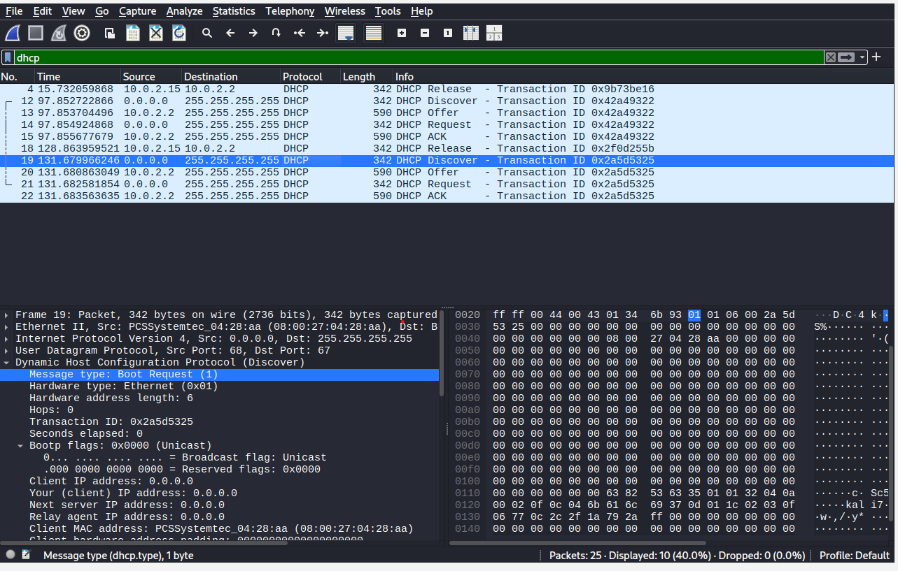
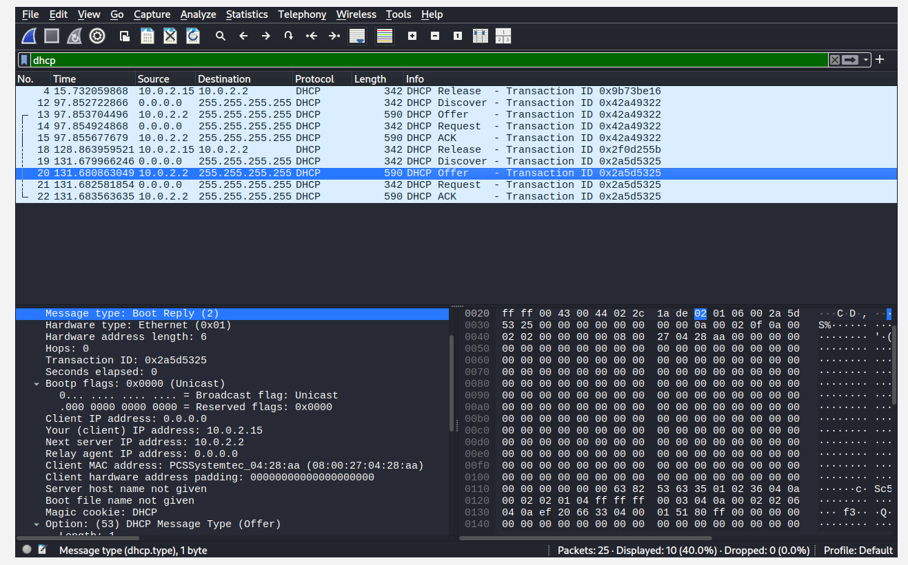
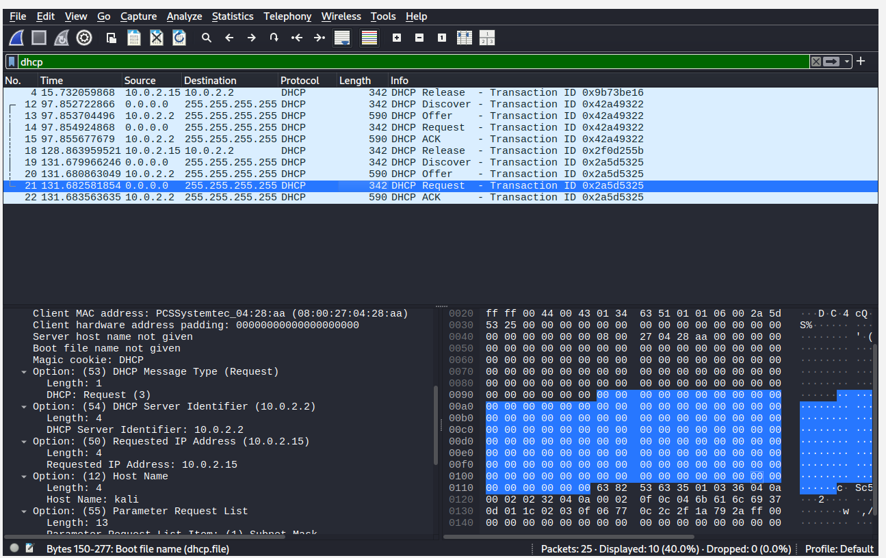
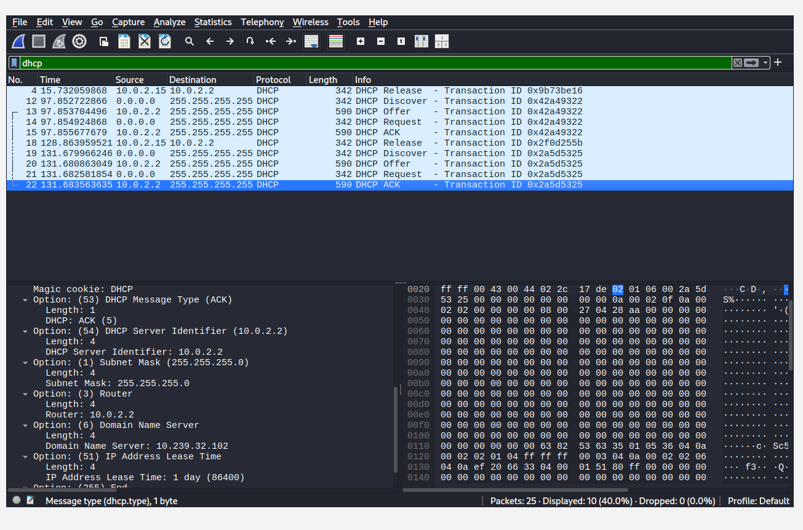
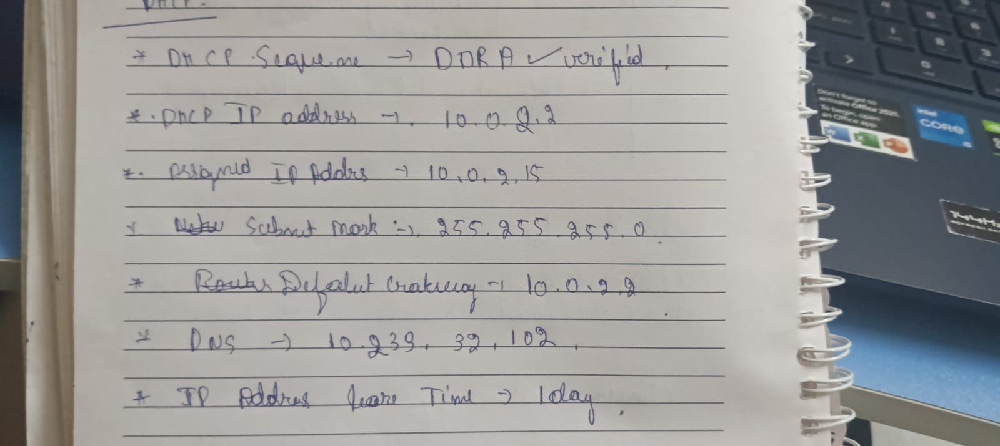

# DHCP Packet Analysis Using Wireshark

## Project Overview

This project demonstrates the analysis of Dynamic Host Configuration Protocol (DHCP) traffic using Wireshark in Kali Linux. The objective is to capture and inspect the DHCP packet exchange, identify the IP address assigned to the client, and examine the network configuration provided by the DHCP server.

---

## Objectives

- Capture DHCP packets using Wireshark.
- Analyze the DHCP DORA (Discover, Offer, Request, ACK) process.
- Identify the DHCP server and assigned client IP address.
- Examine DHCP configuration parameters such as subnet mask, gateway, DNS server, and lease duration.

---

## Tools & Environment

- Kali Linux
- Wireshark
- VirtualBox (NAT Network)
- DHCP-enabled Network

---

## DHCP Packet Flow

```
Client
   │
   ├── DHCP Discover
   │
   ◄── DHCP Offer
   │
   ├── DHCP Request
   │
   ◄── DHCP ACK
```

---

## Project Observations

| Parameter | Value |
|-----------|-------|
| DHCP Process | Discover → Offer → Request → ACK |
| DHCP Server IP | 10.0.2.2 |
| Assigned Client IP | 10.0.2.15 |
| Client MAC Address | 08:00:27:04:28:AA |
| Subnet Mask | 255.255.255.0 |
| Default Gateway | 10.0.2.2 |
| DNS Server | 10.239.32.102 |
| Lease Duration | 86400 seconds (1 Day) |

---

## Screenshots

### DHCP Discover


### DHCP Offer


### DHCP Request


### DHCP ACK


### Observation Notes


---

## Key Learning Outcomes

- Understood how DHCP automatically assigns IP addresses.
- Observed the complete DHCP DORA communication process.
- Learned to inspect DHCP packets using Wireshark.
- Identified DHCP options including subnet mask, gateway, DNS server, and lease duration.
- Gained hands-on experience with network traffic analysis in Kali Linux.

---

## Conclusion

The DHCP packet exchange was successfully captured and analyzed using Wireshark. The project verified the complete DORA process and demonstrated how a client receives its network configuration from a DHCP server.

---

**Skills Demonstrated**
- Network Traffic Analysis
- DHCP Protocol Analysis
- Wireshark
- Packet Inspection
- Network Troubleshooting
- Kali Linux
